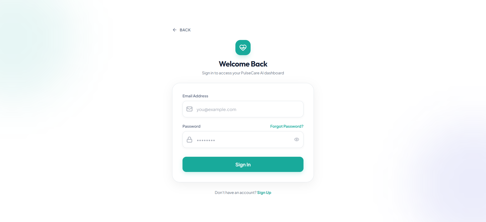
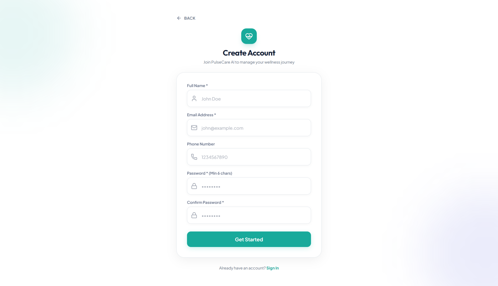
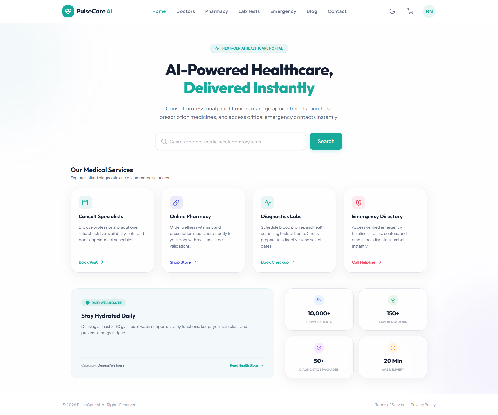
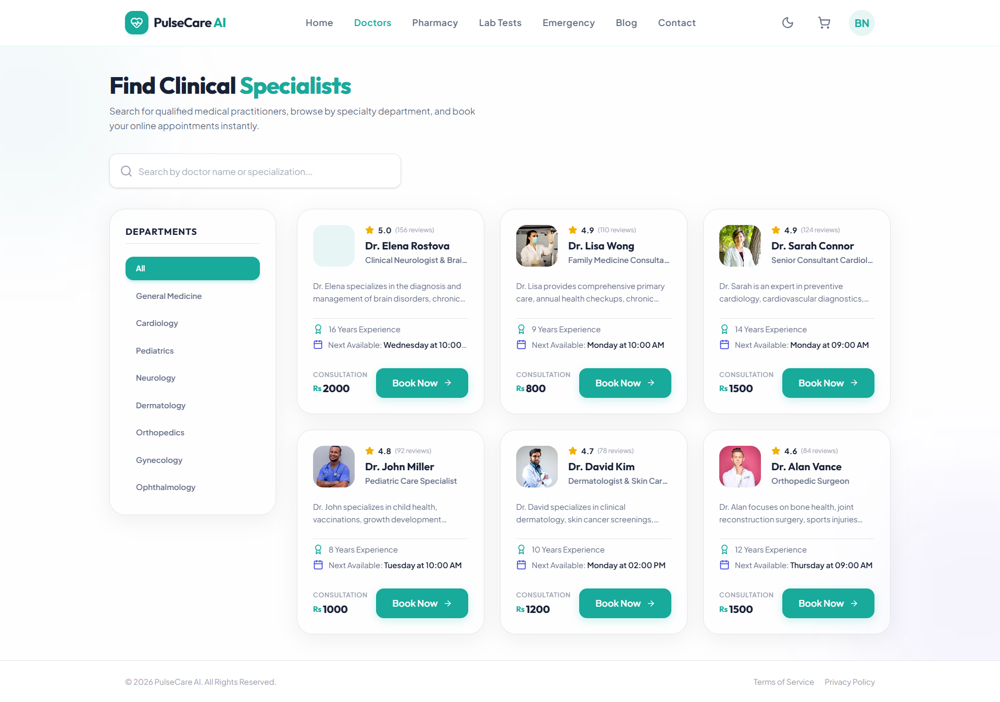
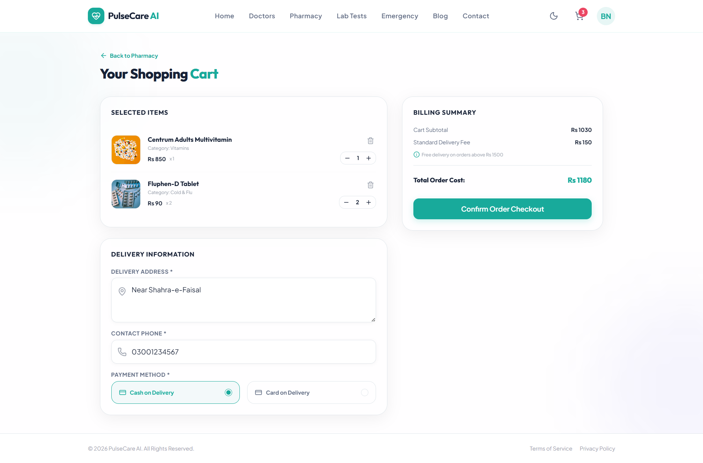
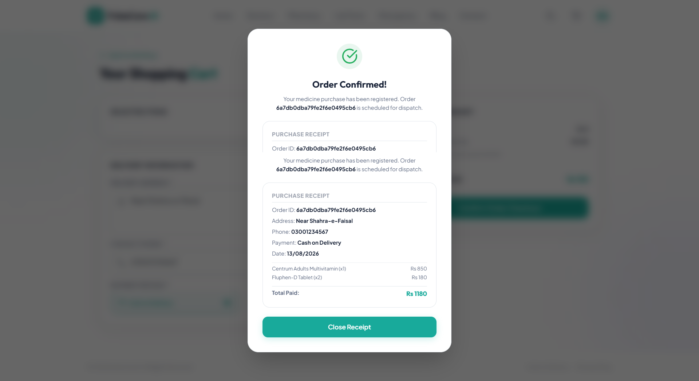
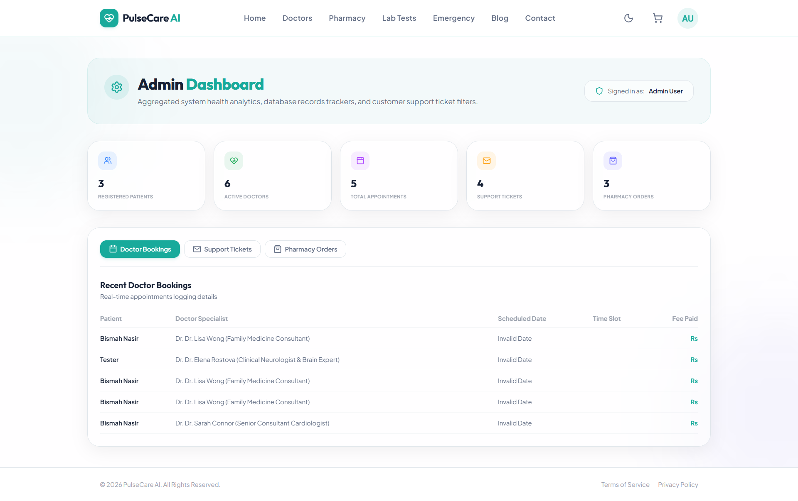

# PulseCare — AI-Powered Healthcare Portal

PulseCare is a responsive, secure, and modern healthcare management web application built to connect patients with medical services instantly. The platform integrates a medical directories directory, digital prescription shopping cart transactions, diagnostic lab scheduling, emergency phone dials, and blogs.

---

## 🚀 Key Features

*   **Specialist Consultations**: Browse certified medical practitioners, filter by departments (Cardiology, Pediatrics, Neurology, etc.), view live slots availability, and book digital appointments.
*   **Online Pharmacy Store**: Purchase prescription and over-the-counter wellness medications. Integrates real-time stock deductions and client-side prescription requirement alerts (Rx).
*   **At-Home Diagnostics Labs**: Schedule blood profile screenings and general checks. Access clear preparation guides, turnaround times (TAT), and fasting requirements.
*   **Emergency Contact Directory**: Instant access to local ambulance networks, critical blood banks, 24/7 trauma clinics, and emergency direct dial shortcuts.
*   **Health & Wellness Blog**: Explore medical advisories, dietary tips, and mental wellness guides written by certified clinical consultants.
*   **Billing & Shipping Checkout**: Manage items inside your shopping cart, input delivery info, select payment methods (Cash or Card on Delivery), and compile instant transactions receipt modals.
*   **Admin Sales Dashboard**: High-level telemetry displaying total clinic revenue, bookings count, pharmacy orders, active users count, and detailed transaction modals.

---

## 🎨 Premium UI Aesthetics & Animations

PulseCare features a custom visual system built using **Tailwind CSS v4** and **Framer Motion**:
*   **Brand Loader Overlay**: Intro splash animation showing the medical logo on a primary teal background.
*   **Eased Count-Up Counters**: Trust metrics count up from 0 using hardware-accelerated `requestAnimationFrame` with smooth deceleration.
*   **Staggered Card Reveals**: Lists, grids, and elements slide up sequentially in waves.
*   **Hover Lift & Photo Zoom**: Subtle cards hover offsets and image zooms on catalog products.
*   **Framer Motion Page Transitions**: Entering pages slide up and fade in smoothly using keyed locations.
*   **Grayscale Disabled Controls**: Active buttons turn neutral gray and block pointer clicks during submissions.
*   **Manual/System Dark Mode**: Automatic dark theme colors mapping.

---

## 🛠️ Technology Stack

*   **Frontend**: React 19 (Vite), Tailwind CSS v4, Framer Motion, Lucide React, React Router 7.
*   **Backend**: Node.js, Express, Mongoose, JSONWebTokens, Bcrypt.js, Node Mailer.
*   **Database**: MongoDB Atlas.

---

## 📦 Installation & Setup

### Prerequisites
*   Node.js (v18.0.0 or higher)
*   MongoDB Local Community Server or a MongoDB Atlas Cloud account

### 1. Database Configuration
1.  Navigate to the `backend/` directory.
2.  Create a `.env` file:
    ```env
    PORT=5000
    MONGODB_URI=mongodb+srv://<username>:<password>@cluster0.mongodb.net/pulsecare_db?retryWrites=true&w=majority
    JWT_SECRET=your_custom_secure_jwt_secret_key_here
    ```

### 2. Run the Backend Server
```bash
cd backend
npm install
npm run dev
```
*The server will start in development mode on `http://localhost:5000`.*

### 3. Run the Frontend Client
```bash
cd ../frontend
npm install
npm run dev
```
*The client app will launch on `http://localhost:5173/`.*

---

## 📸 Screenshots & Previews

### 1. Intro Screen

*Full-screen medical teal branding loader.*

### 2. Login Screen

*Secure credentials input interface with disabled grayscale loading button states.*

### 3. Signup Screen

*Account registration portal with validation guidelines.*

### 4. Home Page

*AI-Powered Hero landing page with synced global search bar layout.*

### 5. Doctors Search Directory

*Specialist department listings with staggered entries and compact Book Now action triggers.*

### 6. Interactive Shopping Cart

*Cart item listings and billing summaries.*

### 7. Order Confirmation Modal

*Custom order transactions modal with purchase receipt summaries.*

### 8. Admin Telemetry Panel

*Tabbed management panel displaying order transactions list and revenue metrics.*

---

## 🔒 Security Measures
*   **DNS Resolution Override**: Overrides standard ISP DNS servers at the entry point of the app (`dns.setServers(['1.1.1.1', '8.8.8.8'])`) to prevent database connection timeouts.
*   **Auth Gates**: Admin panels and booking actions are guarded via server-side JWT verification middleware.
